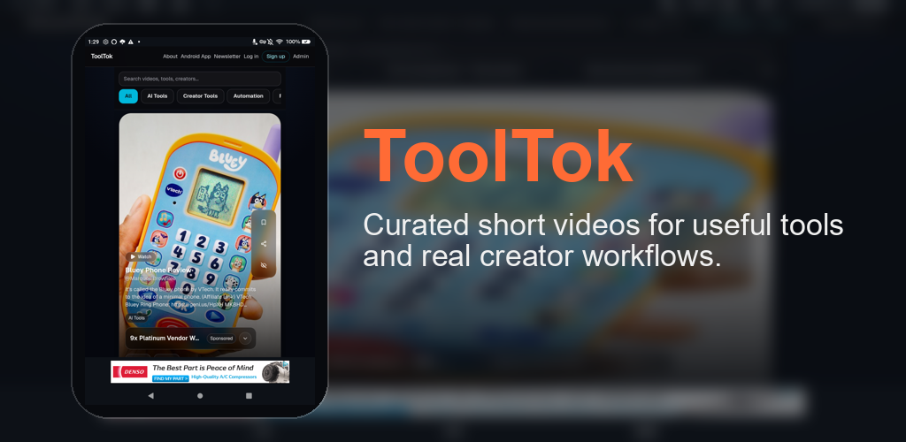
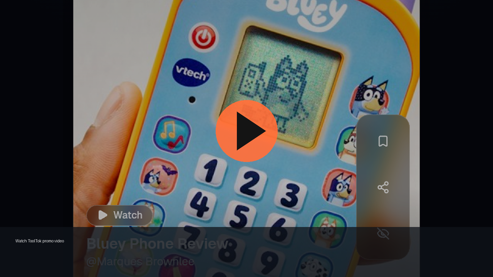
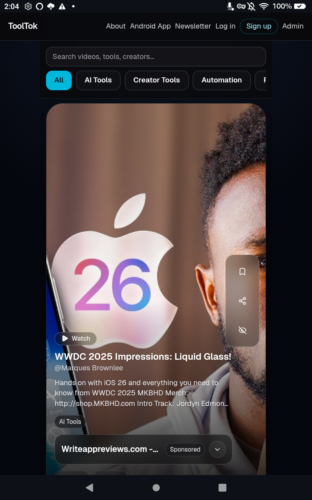
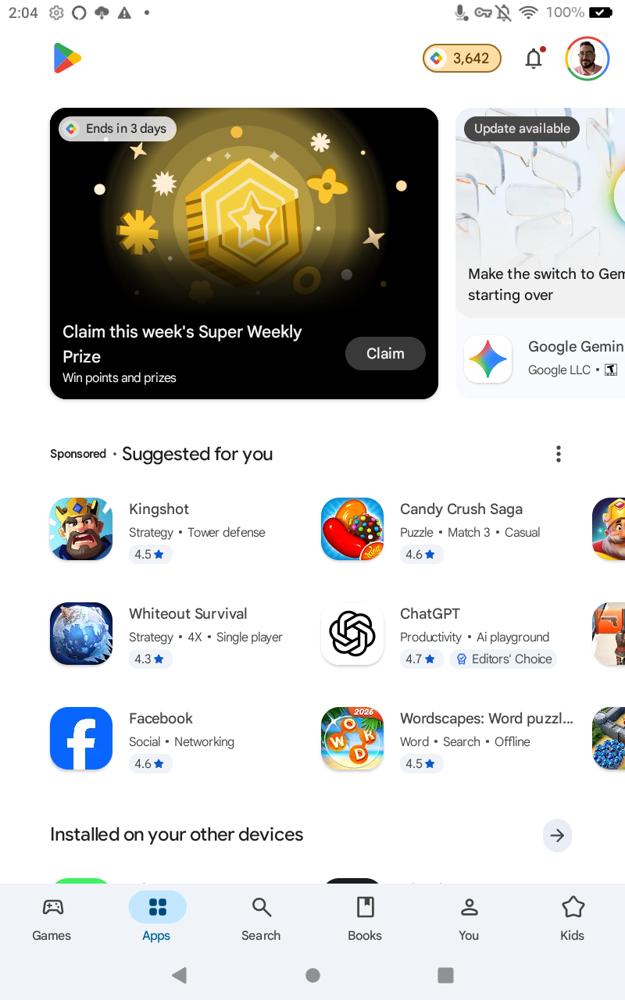
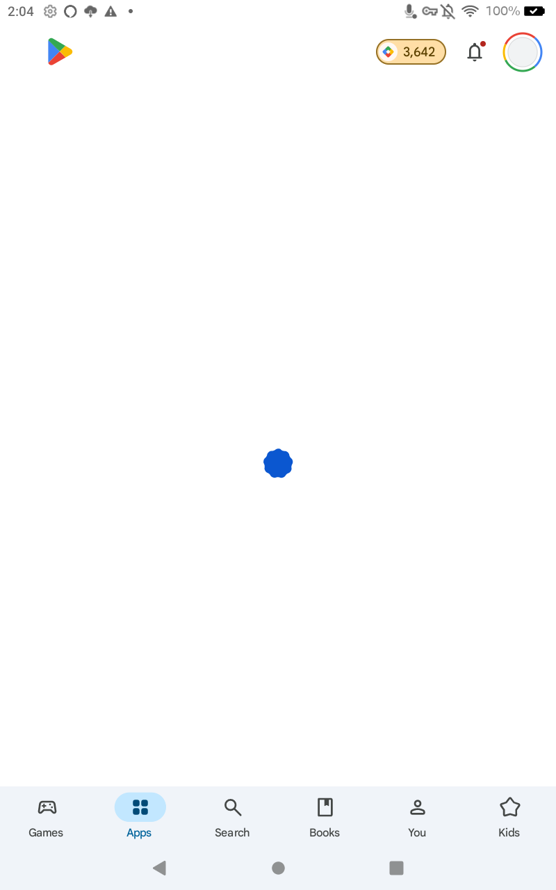
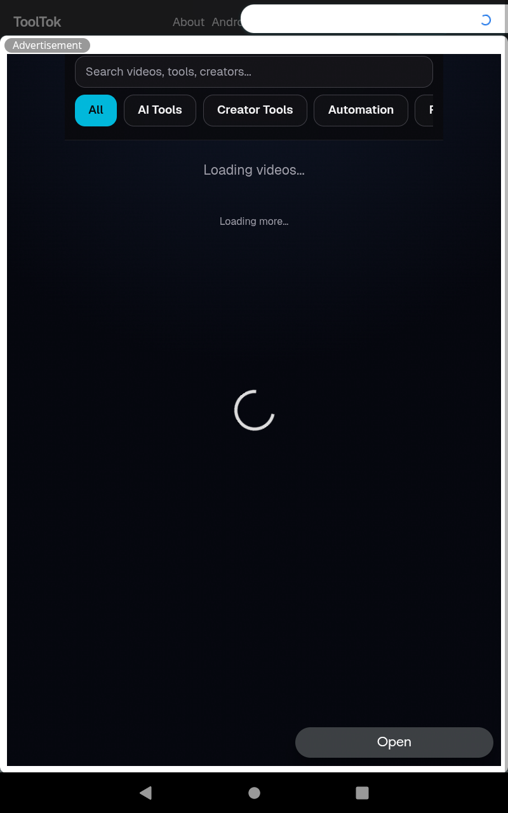
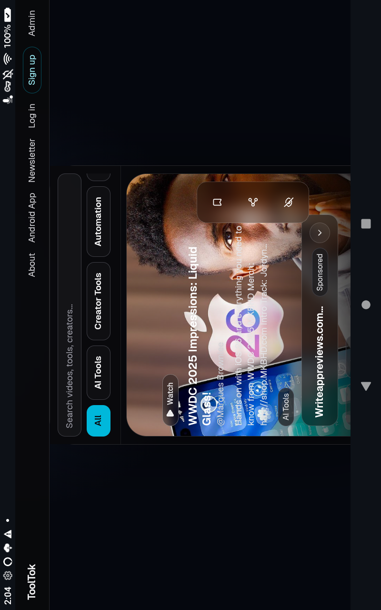

# ToolTok for Android

  

  Discover useful AI tool videos, creator systems, and practical workflow ideas - fast.

  <a href="https://github.com/chartmann1590/ToolTok-App/releases/latest/download/ToolTok-release.apk"><strong>Download APK</strong></a>
  ·
  <a href="https://chartmann1590.github.io/ToolTok-App/">Website</a>
  ·
  <a href="https://tooltok.vercel.app/">Web App</a>

## Promo Video

## Screenshots

  
  
  
  
  

## Why It Hits

- Curated short videos with practical outcomes, not filler
- Fast mobile browsing and discovery loop
- Embedded promo video with voiceover on the live site
- Fresh ADB-captured screenshots and updated media kit assets
