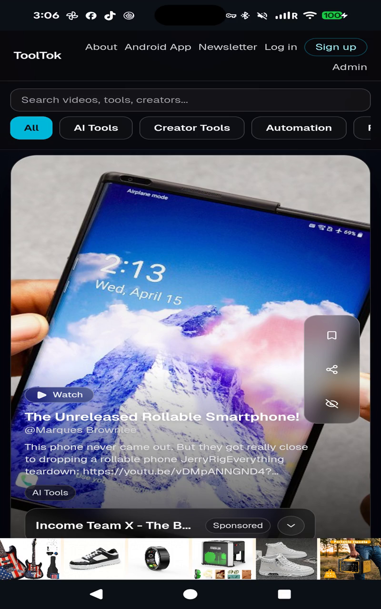

# ToolTok for Android

ToolTok helps you discover short, practical videos about AI tools, creator systems, and real workflows you can use right now.

## Download

- **Android APK:** [Install latest build](https://github.com/chartmann1590/ToolTok-App/releases/latest/download/ToolTok-release.apk)
- **Live app site:** [ToolTok Android page](https://chartmann1590.github.io/ToolTok-App/)
- **Web app:** [tooltok.vercel.app](https://tooltok.vercel.app/)

## Why people use ToolTok

- Curated short-form videos focused on useful outcomes
- Faster discovery of tools worth trying
- Mobile-first browsing with quick external jump-outs
- Same up-to-date ToolTok experience as web

## Promo Video

Tap the thumbnail to watch the embedded promo video with voiceover on the app website.

## Screenshots

  
  
  
  
  

## App Assets

- **Icon:** `site/assets/marketing/app-icon-512.png`
- **Featured image:** `site/assets/marketing/featured-image-1024x500.png`
